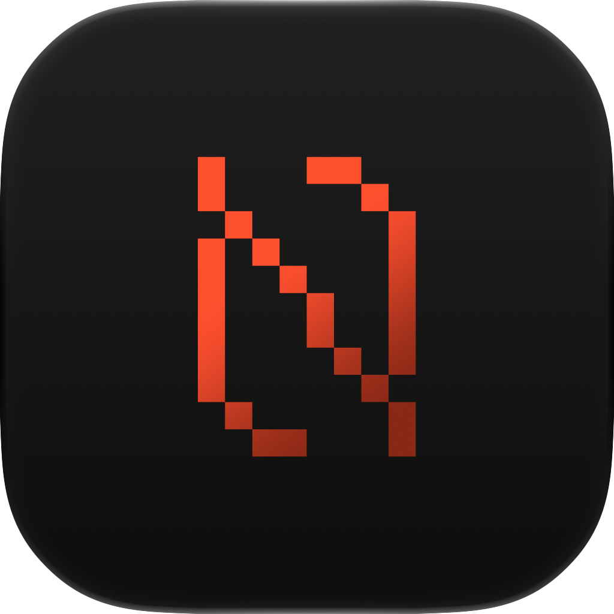
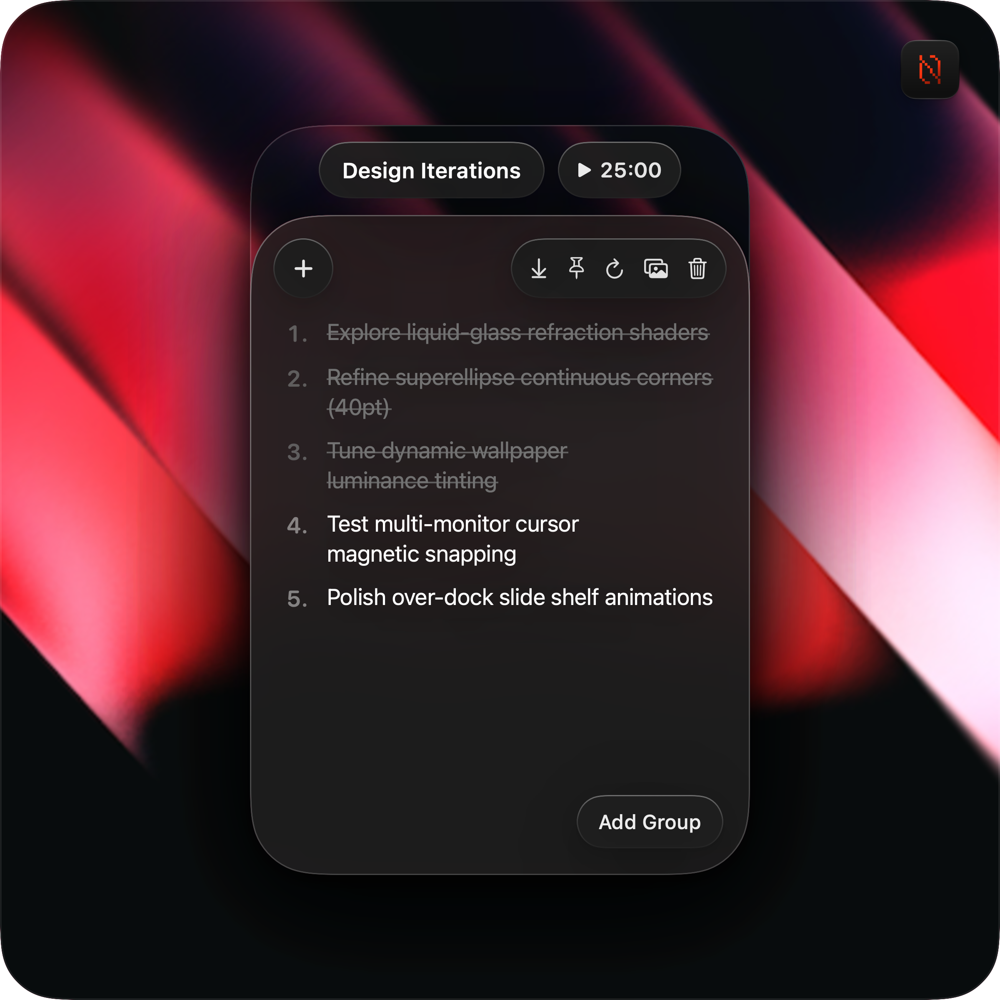
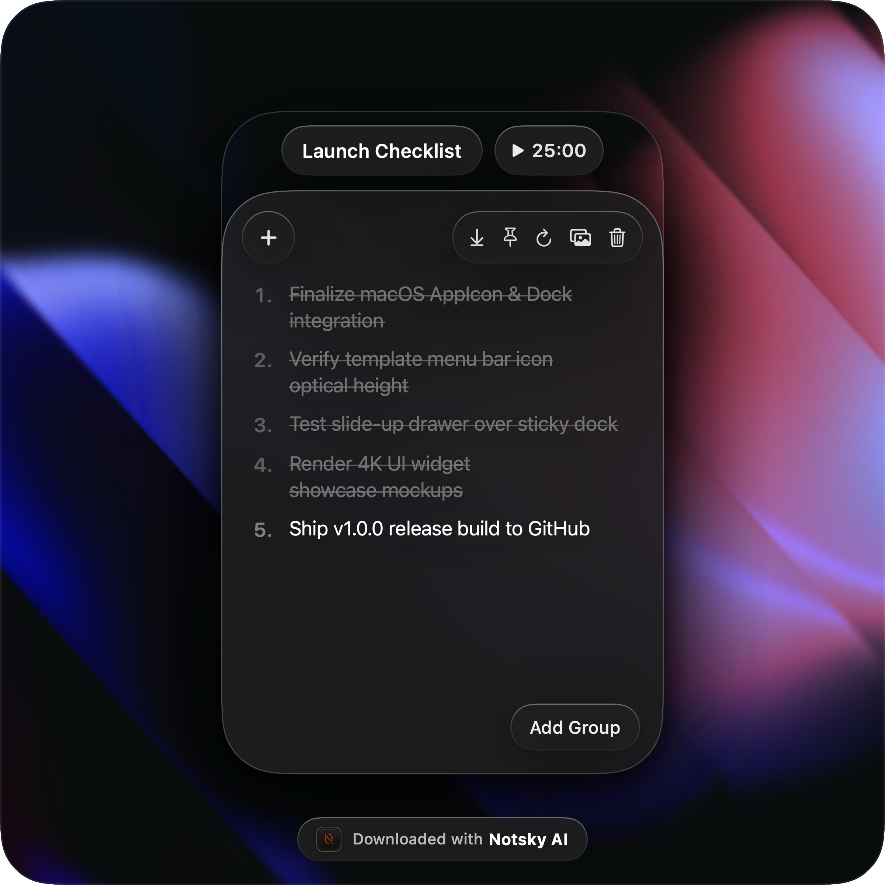
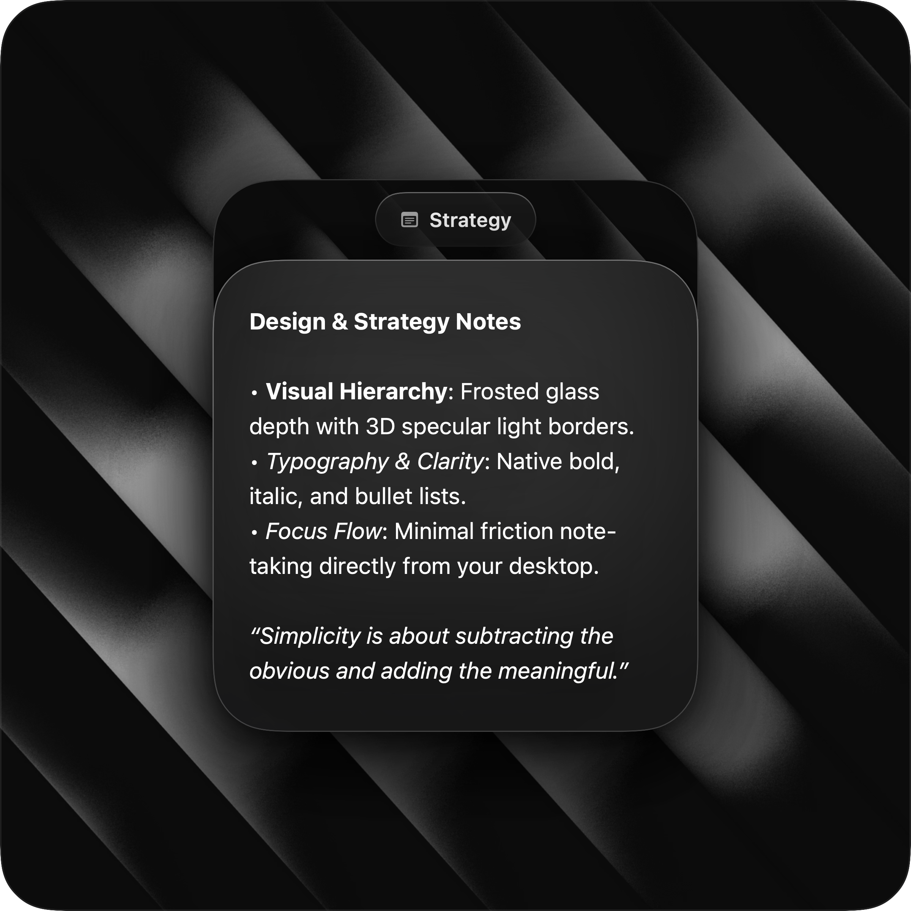
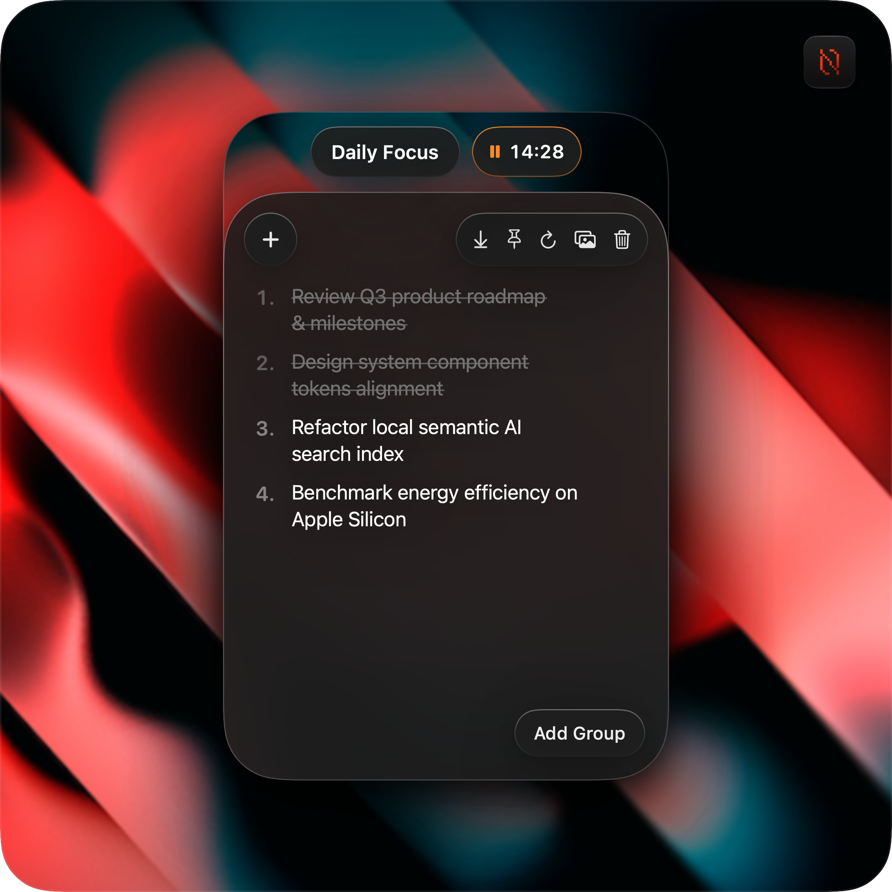
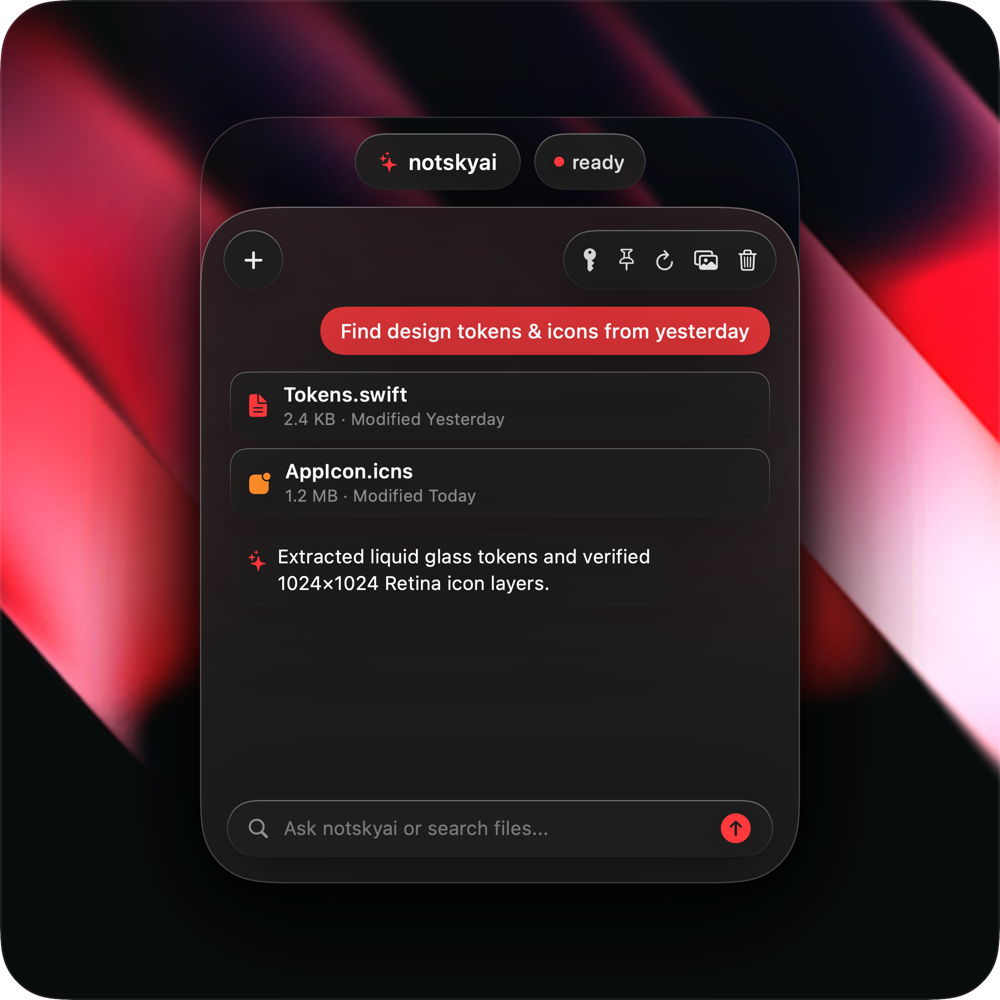

<div align="center">



# Notsky — Liquid-Glass Desktop Notes & AI Workspace

### A native macOS desktop sticky notes & intelligent workspace crafted with SwiftUI, spatial window physics, liquid-glass shaders, and local semantic AI search.

<br />

[](https://apple.com/macos)
[](https://swift.org)
[](https://developer.apple.com/xcode/swiftui/)
[](https://github.com/romeet9/Notsky/releases/latest)
[](LICENSE)

<br />

<p align="center">
  <b>Notsky</b> reimagines the classic macOS desktop note-taking experience as an ultra-tactile, spatial canvas. Built with custom glassmorphism shaders, ambient drop diffusion, multi-display magnetic grid snapping, integrated Pomodoro timers, and a local AI assistant capable of natural date-filtered document discovery.
</p>

<br />



</div>

---

## 📦 Download & Installation

Download the latest pre-built application bundle for macOS Sonoma (14.0+) and Sequoia (15.0+):

<div align="center">
  <br />
  <a href="https://github.com/romeet9/Notsky/releases/latest">
    
  </a>
  <br /><br />
</div>

1. Head to **[Releases](https://github.com/romeet9/Notsky/releases/latest)** and download `Notsky-v1.0.0-macOS.zip`.
2. Unzip and drag **`Notsky.app`** into your `/Applications` folder.
3. Launch **Notsky** from Spotlight (`⌘ Space`) or Applications.

---

## 🌟 Key Highlights & Design Innovations

### 🪟 1. Liquid-Glass Aesthetics & Optical Depth
- **Bespoke Glassmorphism**: Multi-layered background materials utilizing `.ultraThinMaterial`, dynamic ambient luminance sampling, and 3D specular light borders that reflect virtual top-ambient room lighting.
- **Dynamic Accent Chromatics**: Automatically analyzes the underlying wallpaper palette using real-time luminance detection to tint checkmarks, badges, and active timers without manual color picking.
- **Continuous Superellipse Contours**: 40 pt corner radii adhering to Apple's native curvature continuity for seamless hardware-to-software integration.

### 🍱 2. Spatial Multi-Card Taxonomy
- **Task Group Cards**: Interactive checklist items with smooth spring strikethrough animations, inline task creators, and integrated 25-minute Pomodoro focus timers with ambient progress rings.
- **Freeform Notes Cards**: Multi-page rich-text scratchpad supporting bold, italic, and bullet list syntax with instant tab switching and pagination.
- **`notskyai` AI Finder Cards**: A spotlight-style intelligent assistant that searches local documents, extracts single-line gists, reads creation/modification timestamps, and executes cloud queries via OpenRouter (Llama 3.3 70B & Gemini Flash) or instant local fallbacks.

### 🧲 3. Magnetic Multi-Display Grid Snapping
- **Fluid Drag & Auto-Alignment**: Dragging any card near another calculates proximity vectors and snaps smoothly into 2-column or multi-row layouts with consistent 24 pt gutters.
- **Multi-Monitor Cursor Tracking**: Newly spawned widgets calculate active pointer coordinates to appear on whichever physical display the cursor is currently resting on.

### 🪄 4. Slide-Up Notes Shelf (Drawer)
- **Over-Dock Full-Screen Overlay (`⌘⇧D`)**: A frosted glass shelf that slides up on top of the macOS Dock, allowing quick access to all active workspace cards simultaneously without disrupting your window layout.

### 🔊 5. Tactile Audio & Sensory Engine
- **Physical Feedback Simulation**: Custom synthetic audio clicks and macOS Taptic Engine haptics triggered on task toggling, timer completions, card spawning, and wallpaper transitions.

---

## 📸 UI Widget Gallery

<div align="center">
  <table>
    <tr>
      <td width="50%" align="center" valign="top">
        <br/><br/>
        <h3>📋 Design Iterations Task Card</h3>
        <p><i>Task group with interactive checklists, strike-through springs, and visual completion counters.</i></p>
        <br/>
        
        <br/><br/>
      </td>
      <td width="50%" align="center" valign="top">
        <br/><br/>
        <h3>⏱️ Launch Checklist &amp; Pomodoro</h3>
        <p><i>Active focus countdown with progress ring, ambient pulsing glow, and live session stats.</i></p>
        <br/>
        
        <br/><br/>
      </td>
    </tr>
    <tr>
      <td width="50%" align="center" valign="top">
        <br/><br/>
        <h3>📝 Strategy &amp; Multi-Tab Notes</h3>
        <p><i>Rich-text freeform canvas with tabbed pages, quick note switching, and markdown styling.</i></p>
        <br/>
        
        <br/><br/>
      </td>
      <td width="50%" align="center" valign="top">
        <br/><br/>
        <h3>🎯 Daily Focus Snapshot</h3>
        <p><i>High-contrast dark mode card with customized task priority tags and export-ready framing.</i></p>
        <br/>
        
        <br/><br/>
      </td>
    </tr>
    <tr>
      <td colspan="2" align="center" valign="top">
        <br/><br/>
        <h3>✨ notskyai — Smart AI Assistant &amp; Document Finder</h3>
        <p><i>Spotlight-style natural language search with temporal date filtering ("created yesterday", "last week"), inline file match chips, and OpenRouter AI summaries.</i></p>
        <br/>
        
        <br/><br/>
      </td>
    </tr>
  </table>
</div>

---

## ⌨️ Keyboard Shortcuts & Quick Actions

| Shortcut | Action | Scope |
| :--- | :--- | :--- |
| **`⌘⇧D`** | **Toggle Notes Shelf (Drawer)** | Global Hotkey |
| **`⌘N`** | **Spawn New Task Group Card** | App / Menu Bar |
| **`⌘⇧N`** | **Spawn New Freeform Note Card** | App / Menu Bar |
| **`⌥⌘F`** | **Spawn New AI Finder Card** | App / Menu Bar |
| **`⌘,`** | **Open Settings Window** | In-App |
| **`Esc`** | **Dismiss Notes Shelf / Overlays** | In-App |
| **`⌘Q`** | **Quit Notsky** | In-App |

---

## 🏗️ Architecture & Project Structure

```
NotskyApp/
├── Package.swift                     # Swift Package Manager Manifest
├── .github/
│   └── workflows/
│       └── release.yml               # Automated macOS GitHub Actions release pipeline
├── Sources/
│   └── NotskyApp/
│       ├── App.swift                 # @main entry point, MenuBarExtra & App Delegate
│       ├── Models/
│       │   ├── AppSettings.swift     # Persistent settings (Dock visibility, audio, theme)
│       │   ├── NoteModel.swift       # Data structures (Task item, note card, chat messages)
│       │   ├── Store.swift           # Observable workspace store with JSON persistence
│       │   ├── WidgetWindowManager.swift # NSPanel window controller & drag orchestrator
│       │   ├── DrawerWindowManager.swift # Full-screen over-dock shelf controller
│       │   ├── GridSnapManager.swift # Proximity calculation & magnetic slot snapping
│       │   ├── PomodoroManager.swift # Countdown timers, ring progress & notifications
│       │   ├── WallpaperPack.swift   # Built-in gradient packs & custom background switcher
│       │   └── ImageLuminanceDetector.swift # CoreGraphics color/luminance analysis
│       ├── Services/
│       │   ├── AIFinderService.swift # Local filesystem scan & OpenRouter AI synthesis
│       │   └── MenuBarIconManager.swift # Native macOS template icon loader
│       ├── Utils/
│       │   ├── SensoryFeedback.swift # Synthetic audio clicks & haptic trigger pipeline
│       │   ├── ImageDownsampler.swift# Memory-safe thumbnail generation via ImageIO
│       │   └── NaturalDateParser.swift # Date & timeframe range extraction regex
│       └── Views/
│           ├── NoteCardView.swift    # Task checklist card with Pomodoro header
│           ├── FreeformNoteCardView.swift # Multi-tab rich-text note card
│           ├── FinderCardView.swift  # notskyai AI assistant card with Spotlight search
│           ├── DrawerShelfView.swift # Full-screen horizontal card carousel
│           ├── SettingsView.swift    # Native macOS Settings window (⌘,)
│           └── Components/
│               ├── HeaderImageView.swift  # Downsampled background image loader
│               └── CardImageExporter.swift# 4K social media snapshot exporter
└── Resources/
    ├── AppIcon.icns                  # macOS Standard App Icon
    ├── Info.plist                    # Bundle metadata configuration
    └── MenuBarIcon.png               # Menu bar template asset
```

---

## 🚀 Building & Running from Source

### Prerequisites
- macOS Sonoma 14.0+ or Sequoia 15.0+
- Xcode 15.0+ or Swift 6.0+ toolchain

### Quick Build
```bash
# Clone the repository
git clone https://github.com/romeet9/Notsky.git
cd Notsky

# Build optimized release binary
swift build -c release

# Run directly
.build/release/NotskyApp
```

### Create Standalone macOS `.app` Bundle
```bash
# Create bundle skeleton
mkdir -p /Applications/Notsky.app/Contents/{MacOS,Resources}
cp .build/release/NotskyApp /Applications/Notsky.app/Contents/MacOS/Notsky
cp Resources/AppIcon.icns /Applications/Notsky.app/Contents/Resources/
cp Resources/MenuBarIcon*.png /Applications/Notsky.app/Contents/Resources/
cp Resources/Info.plist /Applications/Notsky.app/Contents/Info.plist

# Launch Notsky
open /Applications/Notsky.app
```

---

## 👤 Designer & Creator

Designed and engineered by **Romeet Chatterjee** — Product Designer & Design Technologist.

- **Portfolio**: [romeet-portfolio.vercel.app](https://romeet-portfolio.vercel.app)
- **GitHub**: [@romeet9](https://github.com/romeet9)
- **Twitter / X**: [@romeetchatterjee](https://x.com/romeetchatterjee)

---

<div align="center">
  <sub>Crafted with passion for macOS craftsmanship, liquid glass aesthetics, and spatial UI.</sub>
</div>
